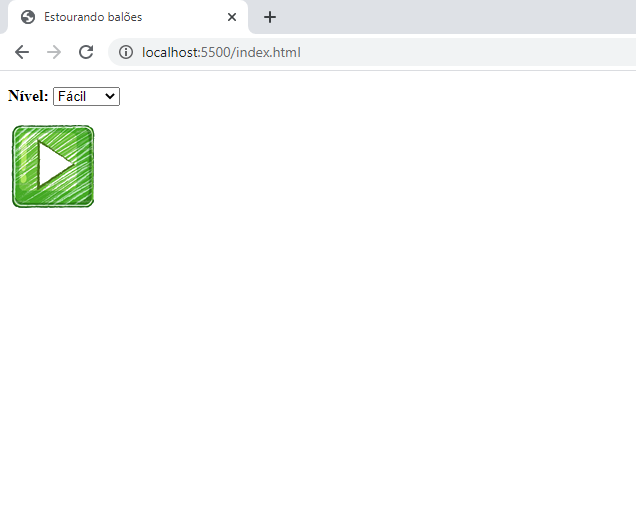
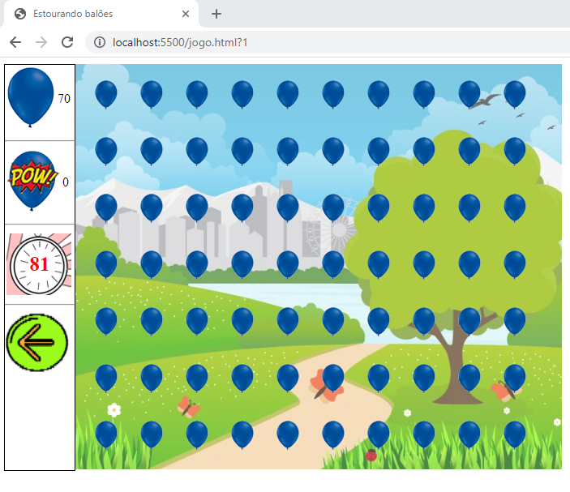
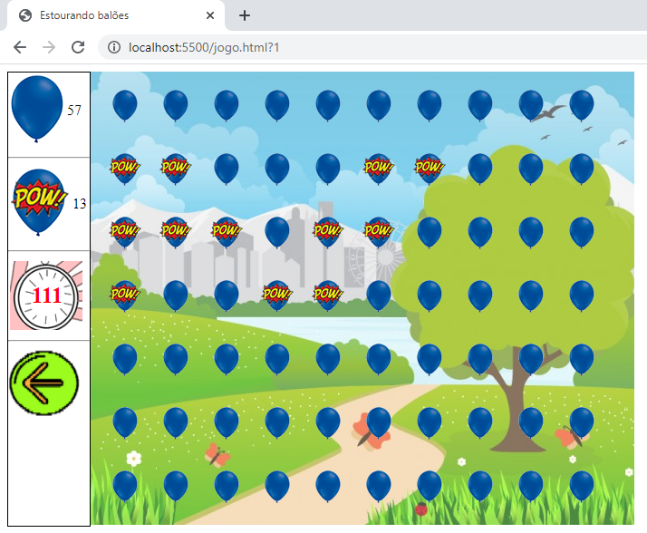

# JOGO BALÕES 

## Javascript, HTML5, CSS3

    

    

    

O jogo possui uma tela inicial onde o jogador escolhe o nível, depois de acordo com o nível ele é redirecionado para outra página onde é carregado o jogo.

A barra da direita tem um contador  de balões-inteiros,  balões estourados, tempo e um ícone de reinicio de jogo.